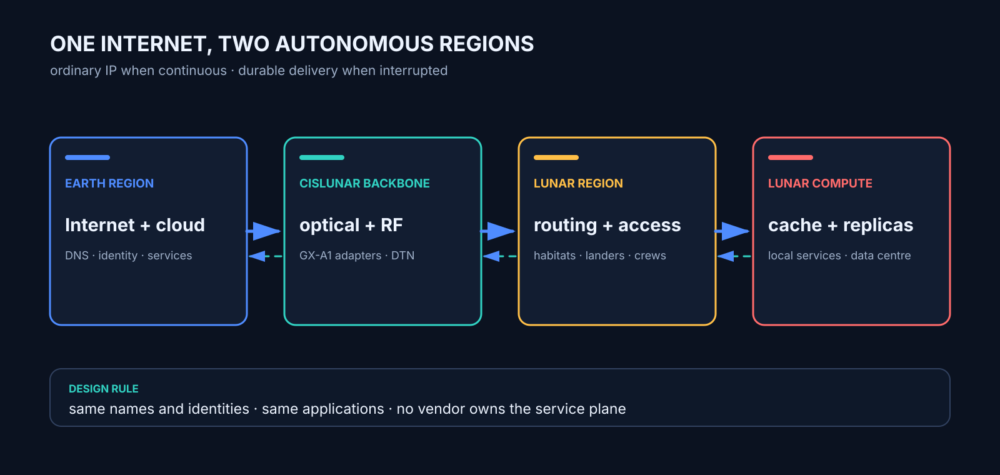
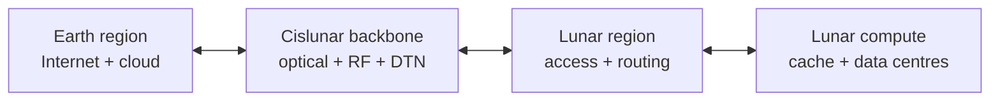
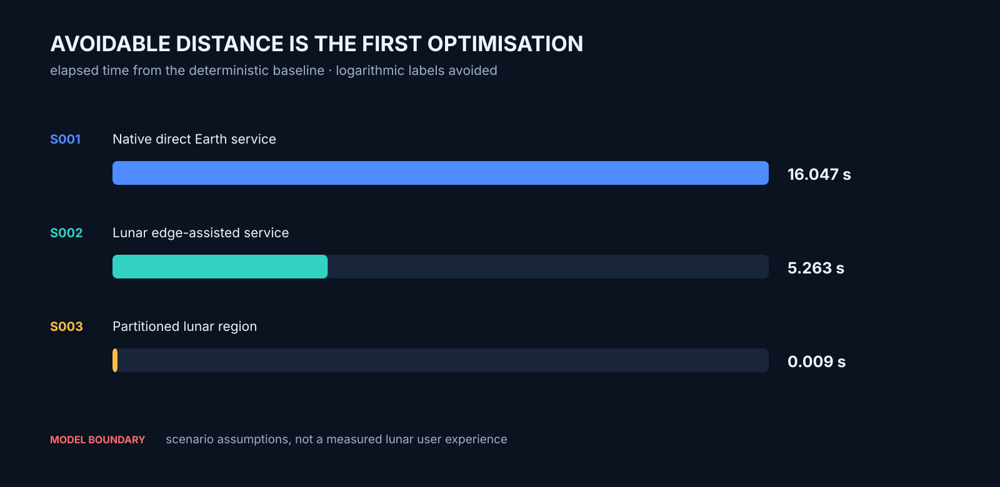
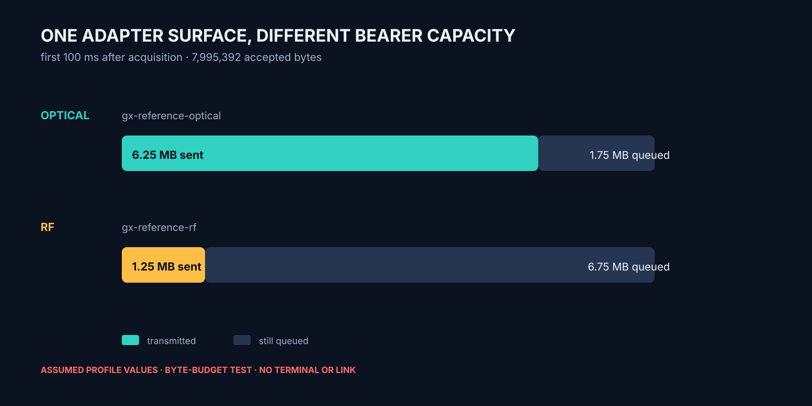
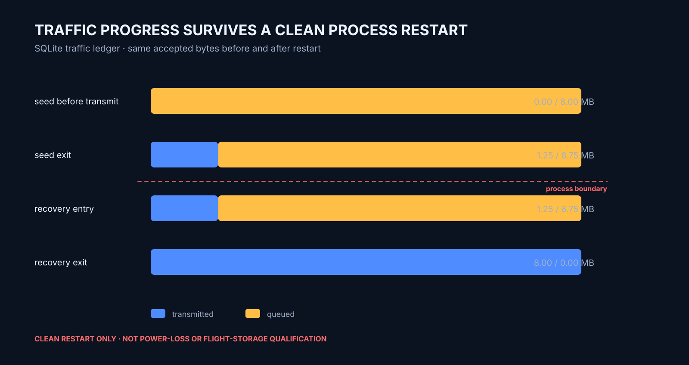

# GatewayCX

**One Internet across Earth and the Moon.**

[](https://github.com/aaaaaaaaaaaavm/GatewayCX/actions/workflows/verify.yml)
[](LICENSE)
[](OPEN_PROBLEMS.md)
[](docs/PROVENANCE.md)

The Internet should not stop being the Internet because its next user is 384,400 km away.

GatewayCX is an exploratory cislunar telecommunications architecture study that I initiated at
Avisys Services in April 2026. I am working out what it takes for an ordinary terrestrial Internet
client to operate natively across an Earth–Moon network: the same browser, domain names, accounts,
certificates and encrypted services, with no mission-specific application required merely to get
online.

The unavoidable difference is light time. At the mean Earth–Moon separation, ideal propagation is
about 1.282 seconds one way and 2.565 seconds round trip. Relays, queues and processing add to it.
Optical communications can move more bits; they cannot make those bits outrun light.

<p align="center">
  
</p>

The system therefore cannot be a long cable with better marketing. GatewayCX treats Earth and the
Moon as two autonomous Internet regions joined by a resilient cislunar backbone. Ordinary IP runs
where continuity permits. Local lunar compute keeps local work local. Caches and replicas remove
avoidable Earth round trips. Delay-tolerant delivery carries data through interruptions. RF and
optical links are interchangeable bearers beneath an open service interface.

> **Current state, 2026-08-27:** architecture and deterministic analytical model. No flight
> hardware has been built, no optical terminal has been tested, and no lunar network has been
> demonstrated. The committed results are model outputs, not measurements.

## The requirement

The terrestrial Internet must work natively across the Earth–Moon network.

In this repository, *natively* has a testable meaning:

1. An unmodified standards-based client can use ordinary DNS, IP, TLS and HTTPS to reach a service
   in the other region when a continuous path exists.
2. The same names, identities and trust relationships remain valid in both regions.
3. Lunar-local traffic does not travel to Earth merely because Earth operates the service.
4. A lunar region retains essential local service during a cislunar partition.
5. Applications may adopt delay-aware features, but basic connectivity does not depend on them.

Native compatibility is not the same as native performance. A handshake-heavy Earth-hosted page
can work correctly and still feel awful over a 2.6-second baseline round trip. The architecture has
three increasingly difficult success levels:

| Level | Meaning |
|---|---|
| Compatibility | Existing Internet clients and services function across the link. |
| Usability | Lunar caches, replicas and compute remove most avoidable cislunar round trips. |
| Resilience | Essential lunar services continue through backbone outages and reconcile later. |

## Architecture



The complete system includes the physical bearers, lunar access networks, IP and disruption-aware
networking, naming and identity, distributed compute, applications, service operations and
governance. CRM, BSS and OSS belong in the operations plane. They are useful, but they are not the
project's centre of gravity.

The first deployment domain is cislunar. The final roadmap extends the same regional model to
orbital settlements, Mars and other planetary networks.

## What runs today

The baseline model is deliberately small. It calculates propagation and serialization time,
executes dependency phases, distinguishes local and cislunar paths, and records whether work
completes or queues during a partition.

```bash
python -m gatewaycx.cli run-all
python -m unittest discover -s tests -v
```

The study register establishes the starting point:

| Study | Question |
|---|---|
| S001 | What does an ordinary Earth-hosted web transaction pay across a continuous lunar link? |
| S002 | How much latency and backbone traffic disappear when static and identity services are local? |
| S003 | Which services remain available when the Earth–Moon backbone is down? |
| S004 | Can an unmodified HTTPS client operate through a mean-distance delayed byte path? |
| S005 | What does an application, gateway and remote service know during interruption and recovery? |
| S006 | What in-flight window and outage storage are implied by advertised backbone capacity? |
| S007 | Where should services run under lunar storage, compute and partition constraints? |
| S008 | Can optical and RF bearers expose one vendor-neutral capability contract? |
| S009 | How does RF fallback protect safety traffic without silently starving science? |
| S010 | What continuity is gained by keeping RF warm around an optical outage? |
| S011 | Can lunar services update through interruption without overwriting the working version? |
| S012 | Can forecast-driven prepositioning beat a simple cache baseline without risking essential content? |
| S013 | Can the lunar network restart its essential services without Earth? |
| S014 | Can one provider-neutral flight record reconstruct an interrupted delivery without payload access? |
| S015 | Do bearer handover, durable recovery and diagnostics agree on one traffic ledger? |
| S016 | Can one executable runtime seam apply optical and RF profiles through fault and recovery? |
| S017 | Does accepted partial-transfer state survive a clean gateway-process restart? |
| S018 | Can the GX-A1 adapter run across a process boundary and reject malformed traffic safely? |

The current declared inputs produce:

| Study | User path | Modelled elapsed time | Completed cislunar data | Result |
|---|---|---:|---:|---|
| S001 | Direct Earth service | 16.05 s | 5.25 MB | Completed |
| S002 | Lunar edge-assisted | 5.26 s | 50 kB | Completed |
| S003 | Partitioned lunar region | 0.009 s local work | 0 B | Local completion; 10 MB queued |

Those figures compare architecture assumptions. They do not predict a particular website, terminal
or network.

<p align="center">
  
</p>

<p align="center">
  
  
</p>

<p align="center"><sub>All three charts are generated from committed model or test results. They
are not terminal measurements or flight evidence.</sub></p>

The generated record is [`results/baseline.json`](results/baseline.json). Its checks are tested in
CI. It is not a network simulator, a link-budget tool or evidence of hardware performance yet.

S004 adds the first socket measurement with an unmodified client. Its
[`method and limitations`](studies/S004_NATIVE_HTTPS.md) are deliberately separate from the
deterministic model.

## Engineering record

- [`ORIGIN.md`](ORIGIN.md) separates the April 2026 origin from the public record.
- [`VISION.md`](VISION.md) defines the end state.
- [`docs/REQUIREMENTS.md`](docs/REQUIREMENTS.md) turns the idea into verifiable requirements.
- [`docs/architecture/SYSTEM_ARCHITECTURE.md`](docs/architecture/SYSTEM_ARCHITECTURE.md) defines the
  initial system boundary and planes.
- [`docs/CLAIM_LEDGER.md`](docs/CLAIM_LEDGER.md) labels every material claim by evidence class.
- [`docs/PROVENANCE.md`](docs/PROVENANCE.md) says what the present results are and are not.
- [`research/STANDARDS_BASELINE.md`](research/STANDARDS_BASELINE.md) records which public
  standards are inherited, profiled or still untested.
- [`docs/architecture/BEARER_CONTRACT.md`](docs/architecture/BEARER_CONTRACT.md) defines the first
  machine-readable GX-B1 hardware/service seam.
- [`docs/architecture/ADAPTER_RUNTIME.md`](docs/architecture/ADAPTER_RUNTIME.md) defines the GX-A1
  executable runtime seam beneath the service plane.
- [`docs/architecture/DURABLE_TRAFFIC_LEDGER.md`](docs/architecture/DURABLE_TRAFFIC_LEDGER.md)
  defines the payload-blind persistent queue and byte-ledger invariants.
- [`docs/architecture/ADAPTER_PROCESS_BINDING.md`](docs/architecture/ADAPTER_PROCESS_BINDING.md)
  defines the local GX-A1 JSONL process boundary and its unfinished security requirements.
- [`docs/FIGURE_INDEX.md`](docs/FIGURE_INDEX.md) maps generated visuals back to their sources and
  evidence limits.
- [`docs/architecture/OPERATIONS_DIAGNOSTICS.md`](docs/architecture/OPERATIONS_DIAGNOSTICS.md)
  defines the GX-O1 portable fault-code and network flight-recorder seam.
- [`research/TRAFFIC_AND_DSN_BOUNDARY.md`](research/TRAFFIC_AND_DSN_BOUNDARY.md) separates a lunar
  regional Internet from the already oversubscribed deep-space antenna network.
- [`docs/INNOVATION_METHOD.md`](docs/INNOVATION_METHOD.md) turns cross-industry inspiration into
  falsifiable mechanism transfers rather than loose analogy.
- [`OPEN_PROBLEMS.md`](OPEN_PROBLEMS.md) keeps unresolved engineering visible.
- [`ROADMAP.md`](ROADMAP.md) gives the build order and exit criteria.

## Vendor position

GatewayCX specifies capabilities and interfaces, not a preferred terminal manufacturer. An
optical terminal from Astrogate or another supplier may satisfy a bearer profile; an RF provider
may satisfy another. No vendor is a dependency, partner or endorsed supplier unless a later public
record says so explicitly.

## Licence

Code, models and documentation are released under the [Apache License 2.0](LICENSE). See
[`NOTICE`](NOTICE) for project attribution. Product names and trademarks remain with their owners.
