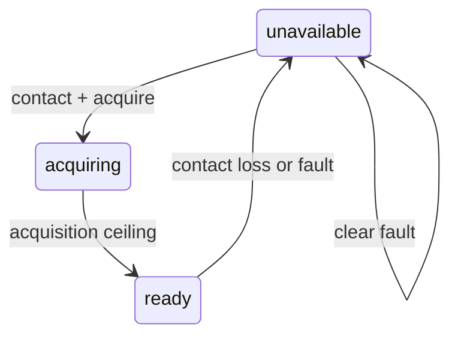

# GX-A1 bearer adapter runtime

## Purpose

GX-B1 says what a bearer claims it can do. GX-A1 is the runtime seam through which the service
plane asks a bearer adapter to expose state and move already-segmented traffic units. Keeping these
roles separate lets a terminal supplier translate a private control API once instead of teaching
every GatewayCX service about terminal-specific acquisition, queue and fault semantics.

GX-A1/0.1 is an exploratory Python interface. It is not a wire protocol or published standard.

## Operations

| Operation | Required behaviour |
|---|---|
| `capabilities` | Return the conformant GX-B1 profile and supported runtime operations. |
| `snapshot` | Return portable link, rate, queue, contact, fault and byte-ledger state. |
| `submit` | Accept, reject or recognise a traffic-unit identifier without receiving plaintext. |
| `set_contact` | Inject the contact availability known to this adapter instance. |
| `acquire` | Start acquisition only when contact exists and no fault is active. |
| `advance` | Advance deterministic time and expose completion of acquisition. |
| `transmit` | Drain no more than the profile capacity permits for the declared interval. |
| `inject_fault` | Apply a portable GX-O1 bearer fault while preserving committed queued traffic. |
| `clear_faults` | Clear the reference fault latch; contact and acquisition remain separate steps. |

Every response carries `api_version`, `bearer_id`, `operation`, `status` and
`observed_offset_s`. Operation-specific fields extend that envelope. Offsets are monotonic and a
rounded offset returned by the adapter can safely be supplied to a later call.

## Reference state path

Clearing a fault does not imply that contact exists or a terminal is already reacquired. This
prevents a provider adapter from converting an internal alarm clear into an unsupported end-to-end
availability claim.

## Queue and identity rules

- The reference adapter receives a traffic-unit identifier, byte count, class and deferred flag;
  it receives no payload content.
- A unit larger than the GX-B1 maximum traffic unit is rejected. Higher layers own segmentation.
- Reusing an accepted identifier returns `duplicate_known` and cannot increment the durable ledger.
- An offline unit is accepted only when both the unit and the profile allow deferred delivery.
- Accepted bytes always equal transmitted plus queued bytes inside the reference ledger.
- A contact loss blocks transmission but does not erase accepted queued bytes.
- The reference reports `process_memory` persistence explicitly; it does not claim crash durability.

## Supplier boundary

A supplier can implement this surface above an optical terminal, RF modem or hybrid network while
keeping pointing, waveform, modem and internal fault details private. Portable state describes the
effect on GatewayCX traffic; provider extensions can retain the physical root cause.

The current `ProfileBackedAdapter` is one in-process implementation instantiated with two
illustrative profiles. It proves that the proposed service-plane code can use one surface for two
media descriptions. It does not prove independent implementation, process isolation, physical
control or multi-vendor interoperability. The next binding must put the same semantics across a
process boundary and connect one independently written adapter.
